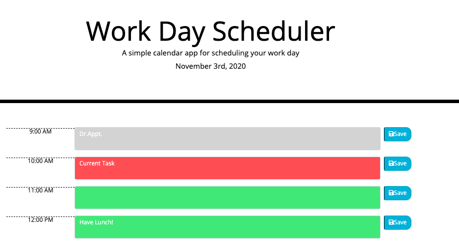

# calendar
Use this daily work calendar for your hourly/daily tasks.


**Criteria provider by the client:**

```
GIVEN I am using a daily planner to create a schedule
WHEN I open the planner
THEN the current day is displayed at the top of the calendar
WHEN I scroll down
THEN I am presented with time blocks for standard business hours
WHEN I view the time blocks for that day
THEN each time block is color-coded to indicate whether it is in the past, present, or future
WHEN I click into a time block
THEN I can enter an event
WHEN I click the save button for that time block
THEN the text for that event is saved in local storage
WHEN I refresh the page
THEN the saved events persist
```

# How to use this calendar:
This calendar will help you with daily tasks. Text/Task area will change colors depending on the time of the day.
* Green Color = means upcoming tasks
* Red Color = means current task (you must complepe!)
* Gray Color = means past task (don't miss it!)

# Mockup:





# Resources:

* Visual Code - used to modify html and css files
* Google developer tools - to test changes
* Chrome, Safari, Firefox - to ensure page render correctly
* Mozilla JavaScript
* Boostrap
* Moment API

# Repository:

* Repository: https://github.com/CivicaJR91/calendar
* Page Link: https://civicajr91.github.io/calendar/


